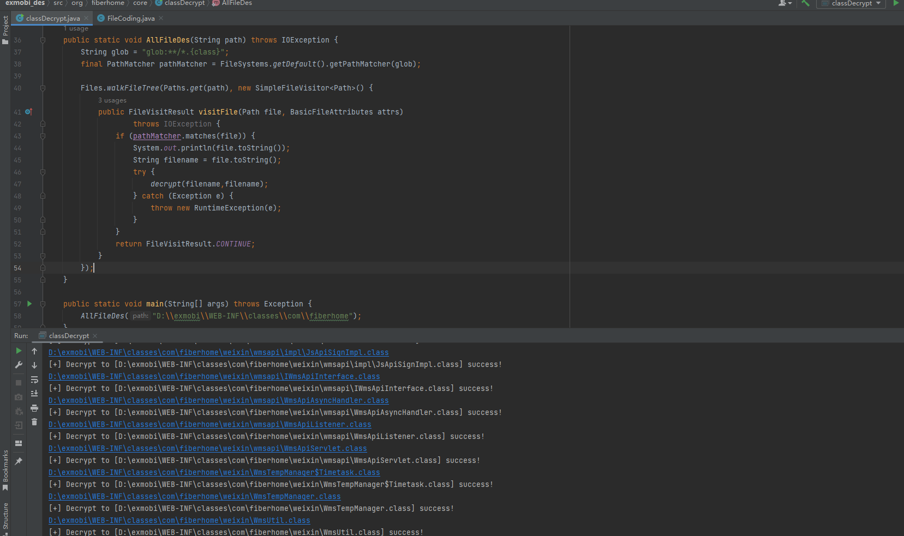

# ExMobi

[TOC]

## 准备工作

环境下载：https://exmobi.xanway.com/product/version.html

下载任意版本，这里下载5.12，之后得到解压得到两个war包。审计老规矩先拖到idea，发现反编译失败，换其他的反编译工具不行，之后发现字节码文件文件幻数不符合JVM 字节码结构，那就是可以确认有混淆或者加密。搜索到前辈的提问：https://zhidao.baidu.com/question/527823421.html，再查找到https://landgrey.me/blog/5/。用fhcrypt.dll直接decrypt解密，这里写个遍历字节码文件调用解密函数就行：

```java
    public static void AllFileDes(String path) throws IOException {
        String glob = "glob:**/*.{class}";
        final PathMatcher pathMatcher = FileSystems.getDefault().getPathMatcher(glob);

        Files.walkFileTree(Paths.get(path), new SimpleFileVisitor<Path>() {
            public FileVisitResult visitFile(Path file, BasicFileAttributes attrs)
                    throws IOException {
                if (pathMatcher.matches(file)) {
                    System.out.println(file.toString());
                    String filename = file.toString();
                    try {
                        decrypt(filename,filename);
                    } catch (Exception e) {
                        throw new RuntimeException(e);
                    }
                }
                return FileVisitResult.CONTINUE;
            }
        });
    }
```

Run:



## 漏洞记录

null


## 参考

- 使用JVMTI技术解密class文件 https://landgrey.me/blog/5/